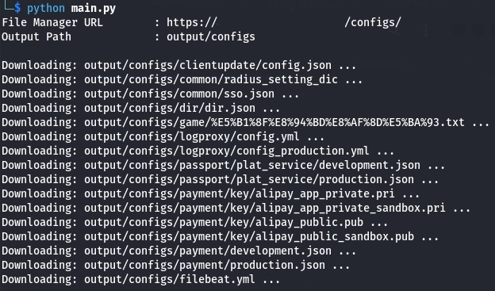

# web-based-fm-scrapper-cli
A simple tool for recursively scraping files from a web-based file manager, using only the base URL as input.

# Requeriments
- Python

# Setup
1. git clone https://github.com/mrizkihidayat66/web-based-fm-scrapper-cli.git
2. pip install -r requirements.txt

# Usage
> python main.py

